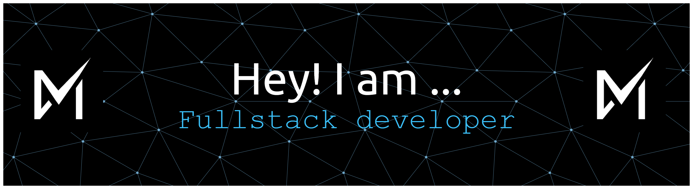

  

  

  
  
  

 **Hello, I'm Maula** 

I'm a passionate developer and informatic student at state of university of jakarta (UNJ), constantly exploring the vast world of technology. My journey in programming is driven by curiosity and the desire to create meaningful solutions.

> _"The best way to learn programming is by doing. Every line of code is a step forward in the journey of continuous learning."_

##

<h3 align="center">Skills & Technologies</h3>

<table style="border: none;">
<tr style="border: none;">
<td style="border: none;"><strong>Languages</strong></td>
<td style="border: none;"></td>
</tr>
<tr style="border: none;">
<td style="border: none;"><strong>Frameworks & Libraries</strong></td>
<td style="border: none;"></td>
</tr>
<tr style="border: none;">
<td style="border: none;"><strong>Tools & Platforms</strong></td>
<td style="border: none;"></td>
</tr>
</table>

##

<h3 align='center'>My Activities</h3>

  
  

### Lastes build projects

###### AI Chat Assistant

   
  

##

<picture>
  <source media="(prefers-color-scheme: dark)" srcset="https://raw.githubusercontent.com/maulaibrahimsyahwi/maulaibrahimsyahwi/output/pacman-contribution-graph-dark.svg">
  <source media="(prefers-color-scheme: light)" srcset="https://raw.githubusercontent.com/maulaibrahimsyahwi/maulaibrahimsyahwi/output/pacman-contribution-graph.svg">
  
</picture>
